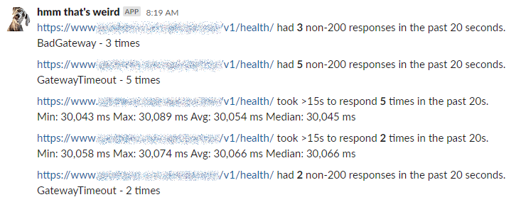

# AvailabilityChecker

## The Problem

When I migrated a service I was working on to run in Kubernetes, I started noticing some 
weird behavior. It would return 502s and 504s randomly, especially during deployments. 
I didn't like it -- that's not supposed to happen. I thought all this Kubernetes stuff 
was supposed to make things super available and Just Work™.

I needed a way to measure when and how much this was happening. 

## Off the shelf solutions?

Kubernetes liveness and readiness checks are OK for their intended purpose, but don't 
check frequently enough. We send the logs of liveness/readiness check failures to a 
log aggregator (SumoLogic), but that takes time. I want to know when this is happening 
in near real-time. 

We use Pingdom, but it's not sensitive enough. 

We use Prometheus and AlertManager for alerting, but even if this was captured in a 
metric (like by Traefik) it would be too much time before it gets scraped and 
AlertManager can evaluate and trigger an alert. Also, I don't know if this would
even be accurately captured in a metric, since I would have to be capturing that 
metric upstream of where this is happening and I don't know where it's happening. 

We use [Goldpinger](https://github.com/bloomberg/goldpinger) and 
[node-problem-detector](https://github.com/kubernetes/node-problem-detector), but 
they only target networking and node health. If this is a problem specific to a pod 
and everything else is fine, they won't show it.

I need something very sensitive that can run _outside_ of the cluster so I can be 
reasonably sure that it's not affected by whatever is happening _inside_ the cluster 
that is causing this behavior.

## Solution

So I wrote this.

This is a console app that makes HTTP GET calls over and over to check for slow and 
non-200 responses. I have it running as a cron job on a VM somewhere outside of our 
Kubernetes cluster hitting the health endpoints on a few of our services. It counts 
up the number of slow and non-200 responses, and if there are any, logs a summary 
of what happened over that period of time. It logs to a file and posts to Slack. 
It uses Reactive Extensions to do that grouping so that it only posts to Slack as 
often as the configured frequency.

It's simple and it's stupid but it works.

I used this to figure out we need to add a prestop lifecycle hook to get zero 
downtime deployments with Traefik [to fix
this problem](https://blog.sebastian-daschner.com/entries/zero-downtime-updates-kubernetes).

I also used it to find that our AWS Auto Scaling Groups were ungracefully terminating 
nodes on us from automatic availability zone rebalancing.

Here's what it looks like posting to Slack:

  

